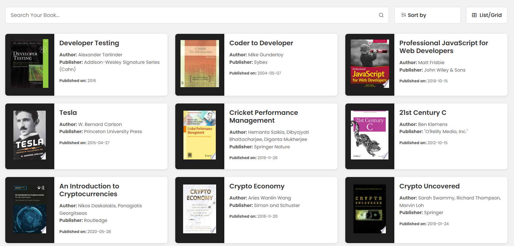
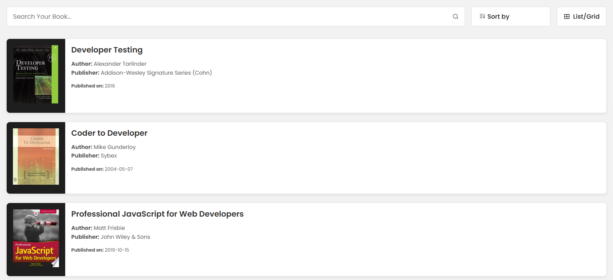
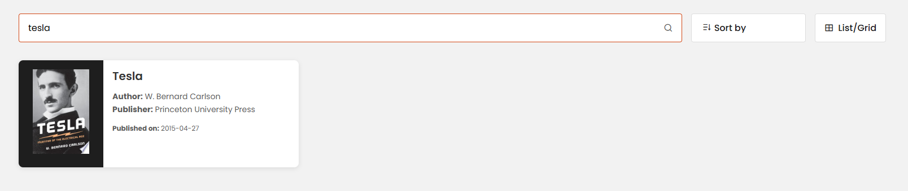

# 📚 FindMyBooks - Discover Your Next Read

<video width="100%" controls>
  <source src="assets/videos/demo.mp4" type="video/mp4">
  Your browser does not support the video tag.
</video>

## 🌟 Overview
**FindMyBooks** is a simple and intuitive web application that allows users to discover and explore books. It fetches book data from an API and provides features like search, sorting, and multiple view options.

🔗 **Live URL:** [FindMyBooks](https://find-my-books.vercel.app/)  
🔗 **GitHub Repository:** [Books-Listing-WebPage](https://github.com/imaaryan/Books-Listing-WebPage)

---

## ✨ Features
- 🔎 **Search Books** - Instantly search for books by title or author.
- 📑 **Sort Options** - Sort books by name or publication date.
- 📖 **List/Grid View** - Toggle between list and grid layout.
- 🚀 **Fast & Responsive** - Works on all devices seamlessly.

---

## 🛠️ Tech Stack
- **HTML** - Structuring the webpage.
- **CSS** - Styling and layout.
- **JavaScript** - Fetching API data and handling interactivity.

---

## 🎥 Demo


---

## 📂 Project Structure
```
📦 Books-Listing-WebPage
├── 📄 index.html       # Main HTML file
├── 📜 index.js         # JavaScript logic for fetching and displaying books
├── 🎨 style.css        # Stylesheet for UI design
├── 📂 assets/images    # Folder for icons and images
```

---

## 🚀 Getting Started
### 🔧 Installation & Setup
1. Clone the repository:
   ```bash
   git clone https://github.com/imaaryan/Books-Listing-WebPage.git
   ```
2. Navigate to the project folder:
   ```bash
   cd Books-Listing-WebPage
   ```
3. Open `index.html` in a browser:
   ```bash
   open index.html
   ```

---

## 📜 Usage
- Type in the search bar to find books.
- Use the **Sort By** dropdown to organize the results.
- Click the **List/Grid View** button to change the layout.
- Click on a book card to view more details.

---

## 🖼️ Screenshots
### 🎨 Grid View


### 📃 List View


### 🔎 Searching for Books


---

## 🏆 Contributing
Contributions are welcome! Feel free to fork the repo and submit a pull request.

---

## 📄 License
This project is licensed under the MIT License.


